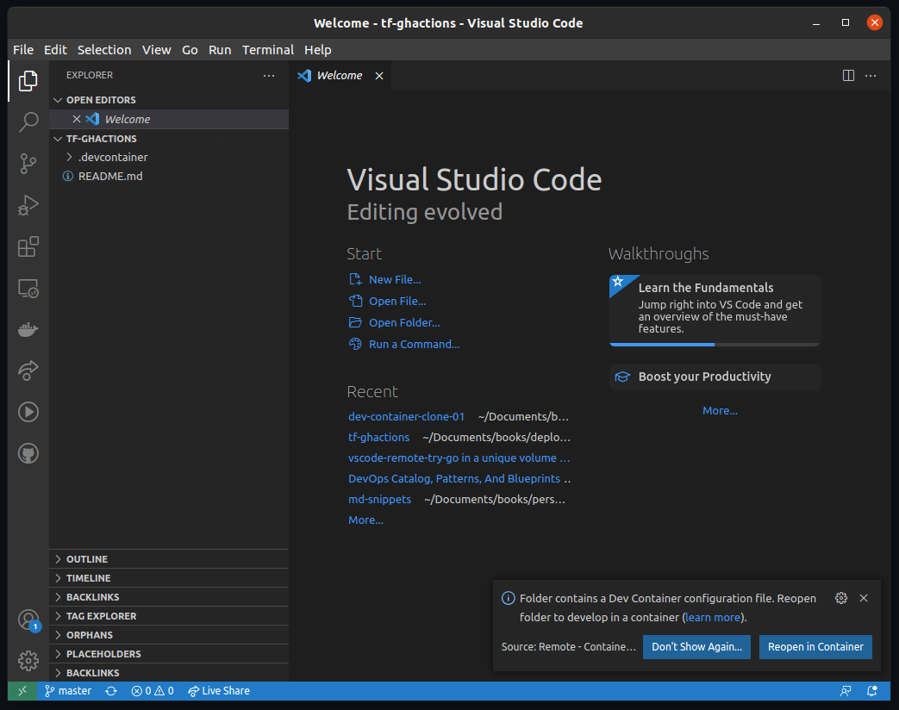

# Terraform Container Development for Sentinel

This document is in construction. 

1. This document will show how to set up your environment for easy collaboration
2. [In this link you will find some Terraform templates](./sentinel-tf.md)

## Target Audience

People interested in DevOps culture and would like to create Infrastructure as Code (IaC).

## Abstract
### VS Code as a dev-container for smart-colaboration

The idea is to create an common environment to a team. In short, a development container is created with all the tools necessary to share Terraform templates across a DevOps team.

## Pre-requisite

You must have [Docker](https://www.docker.com/) installed on your local machine.

## Hands-on session

Download VS Code, then from **VS Code:** _Git: Clone_ utility, you will clone the repository. After that, **VS Code:** will pop-up to **Reopen in Container**. Do it, and wait to the container image to be deployed. 

## Service and related products
 
1. Terraform
2. VS Code 

## Terraform 

The dev-container has the Terraform binary installed.

## VS Code 

The process installs some **VS Code Extensions** to save time for the team.

Extensions:
```
# Snip from devcontainer.json
"extensions": [
        "4ops.terraform",
        "mutantdino.resourcemonitor",
        "ms-azure-devops.azure-pipelines",
        "omartawfik.github-actions-vscode"
    ]
```

## How to use

1. Clone the repository using VS Code.

```
# On Linux
CTRL+SHIFT+P or F1

# Type there
Git: Clone

# Type the repository name
https://github.com/thiagofborn/az-sentinel-tf.git
 
```

2. If the message to **Reopen in Container** does not show up as the picture depicts



* Open a new VS Code Window
* Go to **File** 
* Open the folder
* Select the root folder you have cloned *tf-ghactions*

That will force the **Reopen in Container** to show up.

Almost there.

## Login to your Azure Subscription

First _login_ to your subscription ans select the one you want to work.

```shell
# Login with your Azure user. Open with the browser the URL and paste the code
az login --use-device-code

# List your subscriptions 
az account list

# Select the subscription
az account set --subscription "Choose the subscription name you want to work with"
```

## Terraform Templates

In this project the _Terraform_ templates are located on the _templates_ directory.

[In this link ](./sentinel-tf.md)you will find some Terraform templates dedicated to configure Azure Sentinel.

## Change to the template directory

## References

1. https://code.visualstudio.com/docs/remote/create-dev-container
2. [TODO: Enabling Diagnostics in General](https://registry.terraform.io/providers/hashicorp/azurerm/latest/docs/resources/monitor_diagnostic_setting)
3. [Storage Account Diagnostics]()
4. [Sentinel All-in-One ARM](https://github.com/Azure/Azure-Sentinel/tree/master/Tools/Sentinel-All-In-One)
5. [Planning Costs Azure Sentinel](https://docs.microsoft.com/en-us/azure/sentinel/azure-sentinel-billing#free-data-sources)
6. [O 365 Benefit - Azure Sentinel](https://azure.microsoft.com/en-us/offers/sentinel-microsoft-365-offer/)
7. [CAF - Landing Zones](https://github.com/Azure/caf-terraform-landingzones)
8. [Azure Sentinel Repo](https://github.com/Azure/Azure-Sentinel)
